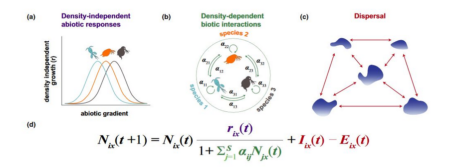

```{r setup, include=FALSE}
knitr::opts_chunk$set(echo = TRUE)
```

## The simulation framework

### Install

Borrow from Thompson et al. (2020) and slightly modified.

To install from GitHub

```{r, eval=F}
devtools::install_github("mxdub/TMDSpatial")
```

You'll also need JAGS and R2jags :

JAGS can be download & installed from : <https://sourceforge.net/projects/mcmc-jags/files/>

R2jags, with the install.package() from R.

```{r, message=F, output = F, results='hide', warning=FALSE}
library(TMDSpatial)
library(R2jags)
# Some additional packages might be needed:
library(tidyverse)

```

### Use

Function is quickly described on GitHub - see Thompson et al. (2020) for details on implementation. The overall idea :



We are going to use only the simulation function : *simulate_MC()*. All parameters can be view in the help (?simulate_MC()). Main parameters are already set for our use here.

For occupancy models, we will use only two species.

The typical use of that function :

```{r, message=F, output = F, results='hide', warning=FALSE}

n_patch = 200
n_species = 2

sim = simulate_MC(patches = n_patch,     # Number of patch
                  species = n_species,   # Number of species
                  kernel_exp = 0.001,    # Rate of decrease of disp. kernel (e.g. P(disp) = exp(-kernel_exp*dist(i,j)))
                  env1Scale = 100,
                  env_optima = c(0.35, 0.65),
                  env_niche_breadth = 0.07,
                  int_mat = matrix( c(0.05,0.00,
                                      0.00,0.05) , nrow = 2, ncol = 2),
                  local_start = F)

```

At the end of simulation. Two plots are displayed - (i) species 'environmental niche', (ii) interaction matrix.

In this case; environmental niche breadth are small (env_niche_breadth = .1), dispersal is not limited by distance (kernel = -0.001), and species are interacting.

The dispersal kernel :

```{r}
curve(exp(-0.001*x), xlim = c(0,140), ylim = c(0,1)) # Max distance among patch is ca. 140 units
```

You can also plot patches in space, with their environmental value to see how environmental values are clustered in space.

```{r}

plots_envt(sim)

```

In the end, you also have some helper functions to gather some data from the simulation output :

To get environmental values and geographical positions :

```{r}

data_envt = get_envt(sim)
data_geo = get_geoposition(sim)

```

And to get abundances and/or occupancies (i.e. presence/absence)

```{r}

abundances = sim_to_matrix(sim)
occupancies = abund_to_occ(abundances)

```

And lastly, it's possible to plot directly occupancies over time for all species:

```{r}

plots_occupancies(occupancies)

```

We will work on occupancy data (i.e. presences / absences)

All models used after can be download from <https://github.com/mxdub/TMDSpatial_data/model/> and put into a model/ folder within our working directory.

## One species

### Simple metapopulation model (MacKenzie like) - with time-constant colonization rate

A simple occupancy model is the one from MacKenzie et al. 2003.

Probability of occupancy can be define as :

$$x_t = x_{t-1} (1-\epsilon) + (1 - x_{t-1}) \gamma $$

Where both $\epsilon$ and $\gamma$ as constant probabilities.

JAGS implementation is given in the MacKenzie_mp.txt file :

```{r, eval = F}

model{

  # Define the underlying model - as well as the observation process (although not used here - d = 1)
  for(i in 1:n_site){
    for(j in 2:n_year){
        obs[i,j] ~ dbern(x[i,j]*detec)
        x[i,j] ~ dbern( x[i,j-1] * (1-e) + (1-x[i,j-1])*c )
    }
  }

  
  # For first year, init with from psi parameter (because the first needs to be fitted)
  for(i in 1:n_site){
    x[i,1] ~ dbern(psi)
  }
  
  # Indicating the logit link
  logit(e) = e_log
  logit(c) = c_log
  logit(psi) = psi_log
  # logit(detec) = detec_log
  detec = 1

  
  # Define prior for e/c/psi on logit scale
  e_log ~ dnorm(0, 0.1)
  c_log ~ dnorm(0, 0.1)
  psi_log ~ dnorm(0, 0.1)
  # detec_log ~ dnorm(0, 0.1)

}

```

Prepare data for JAGS :

```{r}

# Prepare data

serie_length = 20
start_point = 10
species = 2

obs = occupancies[,,start_point:(start_point+serie_length-1)]
obs = obs[species,,]

plot(apply(obs[,], 2, mean), ylim = c(0,1))

# Define # of patch & # of years
n_site = dim(obs)[1]
n_year = dim(obs)[2]

# Create a datalist for JAGS (with needed variables)
datax <- list(obs = obs,
              n_site = dim(obs)[1],
              n_year = dim(obs)[2])

# And also some inits values (only for patch state - needed to replace NA)
x = obs
x[is.na(x)] = sample(c(0,1), sum(is.na(x)), replace = T)
inits = list(list(x = x))

```

Then, fit the model and simulate data

```{r}
parameters <- c('e', 'c', 'psi', 'detec')

jm = jags(model.file = "./model/MacKenzie_mp.txt",
          data = datax,
          inits = inits,
          n.chains = 1,
          n.iter = 1000,
          n.burnin = 500,
          n.thin = 5,
          parameters.to.save = parameters)
# traceplot(jm)

# Estimates from JAGS
print(jm)


# Comparing simulated from estimates to observed

# Gather parameters from JAGS (whole sampled posterior distribution)
e = jm$BUGSoutput$sims.list$e
c = jm$BUGSoutput$sims.list$c

# Set parameters for simulation (50 replicates, for 100 more time steps than used for fitting)

n_rep = 50
time_out_fit = 100

rep = matrix(0, ncol = serie_length+time_out_fit, nrow = n_rep)
z = matrix(0, ncol = serie_length+time_out_fit, nrow = n_site)

for(r in 1:n_rep){
  z[,1] = obs[,1]
  for(i in 2:(serie_length+time_out_fit))
    # Simulate patch dynamic (including uncertainty from the posterior distributions)
    z[,i] = sapply(z[,i-1]*(1-sample(e, 1))+(1-z[,i-1])*sample(c, 1), FUN = function(x) rbinom(1,1,x) )
  rep[r,] = apply(z, 2, mean)
}

# Reformat for plotting

rep = as_tibble(rep) %>% 
  rownames_to_column() %>%
  pivot_longer(-rowname) %>% 
  mutate(name = map_dbl(.x = name,
                        .f = function(x) as.numeric(str_remove(x, 'V'))))

obs_ = occupancies[species,,start_point:(start_point+serie_length-1+time_out_fit)]
obs_ = tibble(year = 1:(serie_length+time_out_fit),
              x = apply(obs_, 2, mean),
              col = c(rep('fitted',serie_length), rep('simulate', time_out_fit)))


ggplot(rep)+
  geom_boxplot(aes(x = name, y = value, group = name))+
  geom_point(data = obs_, aes(x=year, y = x, color = col), size = 4)+
  scale_y_continuous(limits = c(0,1))+
  theme_bw()

```

### Simple metapopulation model (MacKenzie like) - with time-varying colonization rate

How could write a model with time varying colonization rate ? Could that be used for projections ?

### Simple metapopulation model (more Levins like) - with colonization rate depending on mp occupancy

Following Levins metapopulation model, colonization rate should depends on proportion of occupied patches.

A new model can be write following :

$$x_{t+1} = x_{t} (1-\epsilon) + (1 - x_{t}) \gamma_t $$

with

$$\gamma_t = 1 - e^{-c.\bar{x_t}}$$

Note, $c$ is now a rate and not a probability (see line 20 in the Levins_like.txt model - we are therefor using the log() instead of logit())

```{r}
parameters <- c('e', 'c', 'psi', 'detec')

jm = jags(model.file = "./model/Levins_like.txt",
          data = datax,
            inits = inits,
          n.chains = 1,
          n.iter = 1000,
          n.burnin = 500,
          n.thin = 5,
          parameters.to.save = parameters)
# traceplot(jm)

print(jm)

# Simulated

e = jm$BUGSoutput$sims.list$e
c = jm$BUGSoutput$sims.list$c

time_out_fit = 100

rep = matrix(0, ncol = serie_length+time_out_fit, nrow = n_rep)
z = matrix(0, ncol = serie_length+time_out_fit, nrow = n_site)
for(r in 1:n_rep){
  z[,1] = obs[,1]
  for(i in 2:(serie_length+time_out_fit))
    z[,i] = sapply(z[,i-1]*(1-sample(e, 1))+(1-z[,i-1])*(1-exp(-sample(c, 1)*mean(z[,i-1]))), FUN = function(x) rbinom(1,1,x) )
  rep[r,] = apply(z, 2, mean)
}

# Reformat for plotting

rep = as_tibble(rep) %>% 
  rownames_to_column() %>%
  pivot_longer(-rowname) %>% 
  mutate(name = map_dbl(.x = name,
                        .f = function(x) as.numeric(str_remove(x, 'V'))))

obs_ = occupancies[species,,start_point:(start_point+serie_length-1+time_out_fit)]
obs_ = tibble(year = 1:(serie_length+time_out_fit),
              x = apply(obs_, 2, mean),
              col = c(rep('fitted',serie_length), rep('simulate', time_out_fit)))


ggplot(rep)+
  geom_boxplot(aes(x = name, y = value, group = name))+
  geom_point(data = obs_, aes(x=year, y = x, color = col), size = 4)+
  scale_y_continuous(limits = c(0,1))+
  theme_bw()

```

### Simple metapopulation model (MacKenzie like) - with environmental effects on demographic rates

```{r}

# We now need to include environmental data
# Using scaled variable and quadratic effect !

dt_envt_scaled = as.data.frame(scale(data_envt))
dt_envt_scaled$env1sqr = (dt_envt_scaled$env1)^2
  
datax <- list(obs = obs,
              n_site = dim(obs)[1],
              n_year = dim(obs)[2],
              envt = dt_envt_scaled)

parameters <- c('psi', 'mu_c', 'mu_e', 'beta_c', 'beta_e', 'beta_sqr_c', 'beta_sqr_e')

jm = jags(model.file = "./model/MacKenzie_mp_envt",
          data = datax,
            inits = inits,
          n.chains = 1,
          n.iter = 2000,
          n.burnin = 500,
          n.thin = 5,
          parameters.to.save = parameters)

# traceplot(jm)

# library(ggmcmc)
# ggmcmc(ggs(as.mcmc(jm$BUGSoutput$sims.array[,1,])), file = './output1.pdf' )

print(jm)


# Remember, parameters are given in a logit scale, and therefor need to be backtransformed
inv.logit = function(x) 1/(1+exp(-x))

c_related_param = jm$BUGSoutput$sims.array[,1,c('mu_c', 'beta_c', 'beta_sqr_c')]
e_related_param = jm$BUGSoutput$sims.array[,1,c('mu_e', 'beta_e', 'beta_sqr_e')]

envt_matrix = as.matrix(tibble(intcp = 1, env1 = dt_envt_scaled[,1]) %>% mutate(env1sqr = env1^2))

c_boot = inv.logit(c_related_param %*% t(envt_matrix))
e_boot = inv.logit(e_related_param %*% t(envt_matrix))

p_boot = c_boot / (e_boot+c_boot)

to_p=tibble(x = data_envt$env1,
       median = apply(p_boot,2,median),
       q_min = apply(p_boot,2,quantile, 0.025),
       q_max = apply(p_boot,2,quantile, 0.975),
       param = "expect_p")
to_c=tibble(x = data_envt$env1,
       median = apply(c_boot,2,median),
       q_min = apply(c_boot,2,quantile, 0.025),
       q_max = apply(c_boot,2,quantile, 0.975),
       param = "col.")
to_e=tibble(x = data_envt$env1,
       median = apply(e_boot,2,median),
       q_min = apply(e_boot,2,quantile, 0.025),
       q_max = apply(e_boot,2,quantile, 0.975),
       param = "ext.")

toplot = rbind(to_p, to_c, to_e)

ggplot(toplot, aes(x = x, y = median, color = param))+
  geom_point()+
  geom_ribbon(aes(ymin = q_min, ymax = q_max), alpha = 0.1)+
  geom_vline(xintercept=0.65)+
  scale_y_continuous(limits=c(0,1))+
  theme_bw()

## Add simulation ?

n_rep = 50
time_out_fit = 100
samples_length = dim(c_related_param)[1]

rep = matrix(0, ncol = serie_length+time_out_fit, nrow = n_rep)
z = matrix(0, ncol = serie_length+time_out_fit, nrow = n_site)

for(r in 1:n_rep){
  z[,1] = obs[,1]
  for(i in 2:(serie_length+time_out_fit))
    # Simulate patch dynamic (including uncertainty from the posterior distributions)
    z[,i] = sapply(z[,i-1]*(1-inv.logit((e_related_param[sample(1:samples_length, 1),] %*% t(envt_matrix))[1,]))+
                  (1-z[,i-1])*inv.logit((c_related_param[sample(1:samples_length, 1),] %*% t(envt_matrix))[1,]),
                  FUN = function(x) rbinom(1,1,x) )
  rep[r,] = apply(z, 2, mean)
}

# Reformat for plotting

rep = as_tibble(rep) %>% 
  rownames_to_column() %>%
  pivot_longer(-rowname) %>% 
  mutate(name = map_dbl(.x = name,
                        .f = function(x) as.numeric(str_remove(x, 'V'))))

obs_ = occupancies[species,,start_point:(start_point+serie_length-1+time_out_fit)]
obs_ = tibble(year = 1:(serie_length+time_out_fit),
              x = apply(obs_, 2, mean),
              col = c(rep('fitted',serie_length), rep('simulate', time_out_fit)))


ggplot(rep)+
  geom_boxplot(aes(x = name, y = value, group = name))+
  geom_point(data = obs_, aes(x=year, y = x, color = col), size = 4)+
  scale_y_continuous(limits = c(0,1))+
  theme_bw()


```


# Going further...

### And with density-dependent colonization ?

```{r}
jm = jags(model.file = "./model/Levins_like_envt",
          data = datax,
            inits = inits,
          n.chains = 1,
          n.iter = 2000,
          n.burnin = 500,
          n.thin = 5,
          parameters.to.save = parameters)
# traceplot(jm)

print(jm)


# Remember, parameters are given in a logit scale, and therefor need to be backtransformed
inv.logit = function(x) 1/(1+exp(-x))

c_related_param = jm$BUGSoutput$sims.array[,1,c('mu_c', 'beta_c', 'beta_sqr_c')]
e_related_param = jm$BUGSoutput$sims.array[,1,c('mu_e', 'beta_e', 'beta_sqr_e')]

envt_matrix = as.matrix(tibble(intcp = 1, env1 = dt_envt_scaled[,1]) %>% mutate(env1sqr = env1^2))

c_boot = (1-exp(-exp(c_related_param %*% t(envt_matrix)))) # Assuming a full metapopulation
e_boot = inv.logit(e_related_param %*% t(envt_matrix))

p_boot = c_boot / (e_boot+c_boot)

to_p=tibble(x = data_envt$env1,
       median = apply(p_boot,2,median),
       q_min = apply(p_boot,2,quantile, 0.025),
       q_max = apply(p_boot,2,quantile, 0.975),
       param = "expect_p")
to_c=tibble(x = data_envt$env1,
       median = apply(c_boot,2,median),
       q_min = apply(c_boot,2,quantile, 0.025),
       q_max = apply(c_boot,2,quantile, 0.975),
       param = "col.")
to_e=tibble(x = data_envt$env1,
       median = apply(e_boot,2,median),
       q_min = apply(e_boot,2,quantile, 0.025),
       q_max = apply(e_boot,2,quantile, 0.975),
       param = "ext.")

toplot = rbind(to_p, to_c, to_e)

ggplot(toplot, aes(x = x, y = median, color = param))+
  geom_point()+
  geom_ribbon(aes(ymin = q_min, ymax = q_max), alpha = 0.1)+
  geom_vline(xintercept=0.65)+
  scale_y_continuous(limits=c(0,1))+
  theme_bw()

## Add simulation ?

n_rep = 50
time_out_fit = 100
samples_length = dim(c_related_param)[1]

rep = matrix(0, ncol = serie_length+time_out_fit, nrow = n_rep)
z = matrix(0, ncol = serie_length+time_out_fit, nrow = n_site)

for(r in 1:n_rep){
  z[,1] = obs[,1]
  for(i in 2:(serie_length+time_out_fit))
    # Simulate patch dynamic (including uncertainty from the posterior distributions)
    z[,i] = sapply(z[,i-1]*(1-inv.logit((e_related_param[sample(1:samples_length, 1),] %*% t(envt_matrix))[1,]))+
                  (1-z[,i-1])*(1-exp(-exp((c_related_param[sample(1:samples_length, 1),] %*% t(envt_matrix))[1,])*mean(z[,i-1]))),
                  FUN = function(x) rbinom(1,1,x) )
  rep[r,] = apply(z, 2, mean)
}

    
# Reformat for plotting

rep = as_tibble(rep) %>% 
  rownames_to_column() %>%
  pivot_longer(-rowname) %>% 
  mutate(name = map_dbl(.x = name,
                        .f = function(x) as.numeric(str_remove(x, 'V')))) %>%
  mutate(col = case_when(name %in% 1:serie_length ~ 'fit', TRUE ~ 'extra')  )

obs_ = occupancies[species,,start_point:(start_point+serie_length-1+time_out_fit)]
obs_ = tibble(year = 1:(serie_length+time_out_fit),
              x = apply(obs_, 2, mean))


ggplot(rep)+
  geom_boxplot(aes(x = name, y = value, group = name, color = col))+
  geom_point(data = obs_, aes(x=year, y = x), size = 3)+
  scale_y_continuous(limits = c(0,1))+
  theme_bw()

```
